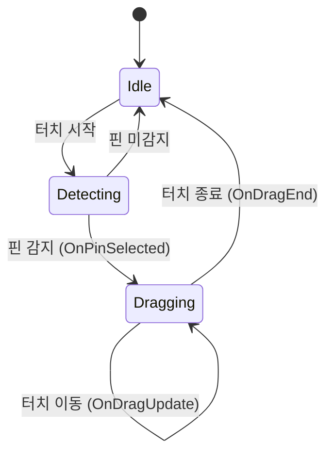

# GDD - SYS_021: InputSystem (입력 시스템)

## 시스템 콘텍스트 요약

| 항목 | 내용 |
|------|------|
| **시스템명** | InputSystem |
| **System ID** | SYS_021 |
| **게임 내 위치** | 게임 플레이 루프 진입점 |
| **소속 씬** | Game Scene |
| **입력 유형** | 터치 (TouchDown, TouchMove, TouchUp) |
| **반복 여부** | 매 프레임 업데이트 |
| **연동 시스템** | DragSystem, HUDSystem |

---

## 책임 범위

1. 터치 입력 감지 (시작, 이동, 종료)
2. 터치 위치를 월드 좌표로 변환
3. 핀 히트 테스트 (Raycast)
4. 입력 이벤트 전파

---

## 입력-처리-출력 구조

### TouchDown (터치 시작)

```
[입력] 화면 터치 시작
[처리]
1. 터치 스크린 좌표 획득
2. 스크린 좌표 → 월드 좌표 변환 (Camera.ScreenToWorldPoint)
3. 월드 좌표에서 핀 히트 테스트 (Physics2D.Raycast 또는 거리 계산)
4. 핀 감지 시 DragSystem에 이벤트 전파
[출력]
- 핀 감지 성공: OnPinSelected(PinData pin, Vector2 touchPos) 이벤트 발생
- 핀 감지 실패: 무시
```

### TouchMove (드래그)

```
[입력] 터치 이동 중
[처리]
1. 현재 터치 스크린 좌표 획득
2. 스크린 좌표 → 월드 좌표 변환
3. DragSystem에 위치 업데이트 전파
[출력]
- OnDragUpdate(Vector2 worldPos) 이벤트 발생
```

### TouchUp (터치 종료)

```
[입력] 터치 해제
[처리]
1. 최종 터치 스크린 좌표 획득
2. 스크린 좌표 → 월드 좌표 변환
3. DragSystem에 드래그 종료 전파
[출력]
- OnDragEnd(Vector2 worldPos) 이벤트 발생
```

---

## 클래스 명세

```csharp
// 클래스명: InputManager
// 유형: MonoBehaviour (Singleton)
// 책임 범위: 터치 입력 감지, 좌표 변환, 이벤트 전파

public class InputManager : MonoBehaviour
{
    // === 필드 ===
    [SerializeField] private Camera _mainCamera;
    [SerializeField] private LayerMask _pinLayerMask;
    [SerializeField] private float _pinHitRadius = 0.5f;

    private bool _isDragging;
    private PinData _selectedPin;

    // === 이벤트 ===
    public event Action<PinData, Vector2> OnPinSelected;
    public event Action<Vector2> OnDragUpdate;
    public event Action<Vector2> OnDragEnd;

    // === 주요 메서드 ===

    // 터치 입력 처리 (매 프레임 호출)
    private void Update()
    {
        HandleTouchInput();
    }

    // 터치 입력 핸들링
    private void HandleTouchInput();

    // 스크린 좌표 → 월드 좌표 변환
    private Vector2 ScreenToWorldPosition(Vector2 screenPos);

    // 핀 히트 테스트
    private PinData TryGetPinAtPosition(Vector2 worldPos);
}
```

---

## 함수 단위 명세

### HandleTouchInput()

```
함수명: HandleTouchInput()
입력: 없음 (Input 클래스에서 직접 읽음)
반환값: void
처리:
    if (터치 시작)
        worldPos = ScreenToWorldPosition(터치 위치)
        pin = TryGetPinAtPosition(worldPos)
        if (pin != null)
            _isDragging = true
            _selectedPin = pin
            OnPinSelected?.Invoke(pin, worldPos)

    else if (터치 이동 && _isDragging)
        worldPos = ScreenToWorldPosition(터치 위치)
        OnDragUpdate?.Invoke(worldPos)

    else if (터치 종료 && _isDragging)
        worldPos = ScreenToWorldPosition(터치 위치)
        OnDragEnd?.Invoke(worldPos)
        _isDragging = false
        _selectedPin = null
```

### ScreenToWorldPosition()

```
함수명: ScreenToWorldPosition(Vector2 screenPos)
입력: screenPos - 스크린 좌표
반환값: Vector2 - 월드 좌표 (2D)
처리:
    Vector3 worldPos = _mainCamera.ScreenToWorldPoint(
        new Vector3(screenPos.x, screenPos.y, _mainCamera.nearClipPlane)
    )
    return new Vector2(worldPos.x, worldPos.y)
```

### TryGetPinAtPosition()

```
함수명: TryGetPinAtPosition(Vector2 worldPos)
입력: worldPos - 월드 좌표
반환값: PinData 또는 null
처리:
    // 방법 1: Physics2D Raycast
    Collider2D hit = Physics2D.OverlapCircle(worldPos, _pinHitRadius, _pinLayerMask)
    if (hit != null)
        return hit.GetComponent<PinController>()?.PinData

    // 방법 2: 거리 계산 (Collider 없이)
    foreach (var pin in GameManager.Instance.Pins)
        if (Vector2.Distance(worldPos, pin.LogicPos) < _pinHitRadius)
            return pin

    return null
```

---

## 상태 흐름



---

## UI 이벤트 트리거

| 입력 요소 | 이벤트 유형 | 이벤트 핸들러 |
|-----------|-------------|---------------|
| 핀 터치 | TouchDown | OnPinSelected() |
| 드래그 | TouchMove | OnDragUpdate() |
| 드롭 | TouchUp | OnDragEnd() |

---

## 시스템 연동 지점

```csharp
// DragSystem 연동
InputManager.OnPinSelected += DragSystem.StartDrag;
InputManager.OnDragUpdate += DragSystem.UpdateDrag;
InputManager.OnDragEnd += DragSystem.EndDrag;

// 입력 잠금 (팝업, 애니메이션 중)
public void SetInputLock(bool locked);
public bool IsInputLocked { get; }
```

---

## LLM 최적화 주석

```
// LLM 설명용: 이 시스템은 터치 입력의 진입점이며, 모든 게임 조작의 시작점입니다.
// LLM 설명용: Orthographic 카메라를 사용하므로 Z좌표는 무시하고 X,Y만 사용합니다.
// LLM 설명용: 핀 히트 테스트는 Collider 기반 또는 거리 계산 중 선택 가능합니다.
// LLM 설명용: 입력 잠금 기능으로 팝업 표시 중 게임 입력을 차단합니다.
```
