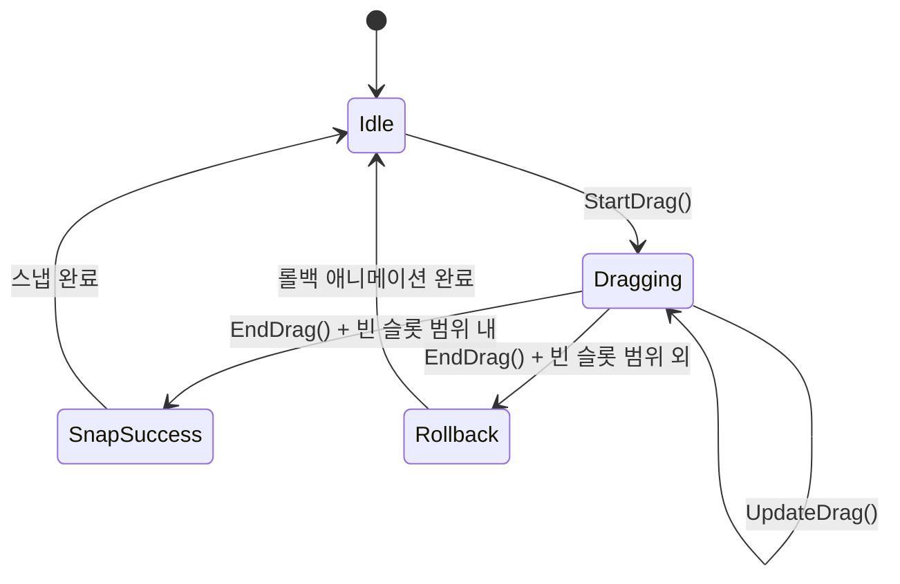

# GDD - SYS_023: DragSystem (드래그 시스템)

## 시스템 콘텍스트 요약

| 항목 | 내용 |
|------|------|
| **시스템명** | DragSystem |
| **System ID** | SYS_023 |
| **게임 내 위치** | 핵심 조작 루프 |
| **소속 씬** | Game Scene |
| **입력 유형** | InputSystem 이벤트 |
| **반복 여부** | 이벤트 기반 |
| **연동 시스템** | InputSystem, SnapSystem, HUDSystem |

---

## 책임 범위

1. 핀 드래그 시작/진행/종료 처리
2. 드래그 중 핀 비주얼 위치 업데이트
3. 가장 가까운 빈 슬롯 탐색 및 하이라이트 요청
4. 드래그 성공/실패 판정 후 SnapSystem에 전달

---

## 입력-처리-출력 구조

### StartDrag (드래그 시작)

```
[입력] OnPinSelected(PinData pin, Vector2 touchPos) 이벤트
[처리]
1. 선택된 핀 저장
2. 원래 슬롯 인덱스 저장 (롤백용)
3. 핀 비주얼 확대 (1.2x)
4. 해당 로프의 RenderPriority 최상위로 변경 (드래그 중 가독성)
5. 드래그 상태 활성화
[출력]
- 핀 확대 애니메이션 재생
- 사운드: sfx_pin_select
- 햅틱: 약한 진동
```

### UpdateDrag (드래그 진행)

```
[입력] OnDragUpdate(Vector2 worldPos) 이벤트
[처리]
1. 핀 비주얼 위치를 worldPos로 이동
2. 현재 위치에서 가장 가까운 빈 슬롯 탐색
3. 빈 슬롯 찾으면 HUDSystem에 하이라이트 요청
4. 연결된 로프의 RenderPath 실시간 갱신 (드래그 프리뷰)
[출력]
- 핀 위치 업데이트
- 스냅 가능 슬롯 하이라이트
- 로프 프리뷰 갱신
```

### EndDrag (드래그 종료)

```
[입력] OnDragEnd(Vector2 worldPos) 이벤트
[처리]
1. 최종 위치에서 스냅 가능한 빈 슬롯 탐색
2. 빈 슬롯 범위 내:
   - SnapSystem.SnapToSlot(pin, targetSlot) 호출
   - 성공 피드백 재생
3. 빈 슬롯 범위 외:
   - 원래 슬롯으로 롤백
   - 롤백 애니메이션 재생
4. 핀 비주얼 원래 크기로 복원
5. 드래그 상태 비활성화
[출력]
- 스냅 성공: 핀 새 위치 고정, sfx_snap, 중간 진동
- 스냅 실패: 핀 원래 위치로 복귀 애니메이션
```

---

## 클래스 명세

```csharp
// 클래스명: DragController
// 유형: MonoBehaviour
// 책임 범위: 핀 드래그 처리, 스냅 프리뷰, 롤백

public class DragController : MonoBehaviour
{
    // === 필드 ===
    [SerializeField] private float _snapRadius = 1.0f;       // 스냅 판정 반경
    [SerializeField] private float _dragScale = 1.2f;        // 드래그 중 핀 확대 비율
    [SerializeField] private float _rollbackDuration = 0.2f; // 롤백 애니메이션 시간

    private PinController _selectedPin;
    private int _originalSlotIndex;
    private SlotData _targetSlot;
    private bool _isDragging;

    // === 이벤트 ===
    public event Action<PinData, SlotData> OnSnapRequested;
    public event Action<SlotData> OnSlotHighlightRequested;
    public event Action OnSlotHighlightCleared;

    // === 주요 메서드 ===

    // 드래그 시작
    public void StartDrag(PinData pin, Vector2 touchPos);

    // 드래그 업데이트
    public void UpdateDrag(Vector2 worldPos);

    // 드래그 종료
    public void EndDrag(Vector2 worldPos);

    // 가장 가까운 빈 슬롯 탐색
    private SlotData FindNearestEmptySlot(Vector2 pos);

    // 롤백 애니메이션
    private void RollbackToOriginalSlot();
}
```

---

## 함수 단위 명세

### StartDrag()

```
함수명: StartDrag(PinData pin, Vector2 touchPos)
입력:
  - pin: 선택된 핀 데이터
  - touchPos: 터치 시작 위치
반환값: void
처리:
    _selectedPin = GetPinController(pin)
    _originalSlotIndex = pin.SlotIndex
    _isDragging = true

    // 비주얼 피드백
    _selectedPin.transform.DOScale(_dragScale, 0.1f)

    // 로프 우선순위 상승
    RopeData rope = GetRope(pin.RopeId)
    rope.RenderPriority = int.MaxValue

    // 피드백
    SoundManager.Play("sfx_pin_select")
    HapticManager.LightImpact()
```

### UpdateDrag()

```
함수명: UpdateDrag(Vector2 worldPos)
입력: worldPos - 현재 드래그 위치
반환값: void
처리:
    if (!_isDragging) return

    // 핀 위치 업데이트
    _selectedPin.transform.position = new Vector3(worldPos.x, worldPos.y, _selectedPin.transform.position.z)

    // 가장 가까운 빈 슬롯 탐색
    SlotData nearestSlot = FindNearestEmptySlot(worldPos)

    if (nearestSlot != _targetSlot)
        OnSlotHighlightCleared?.Invoke()
        _targetSlot = nearestSlot
        if (_targetSlot != null)
            OnSlotHighlightRequested?.Invoke(_targetSlot)

    // 로프 프리뷰 갱신
    UpdateRopePreview()
```

### EndDrag()

```
함수명: EndDrag(Vector2 worldPos)
입력: worldPos - 드래그 종료 위치
반환값: void
처리:
    if (!_isDragging) return

    _isDragging = false
    OnSlotHighlightCleared?.Invoke()

    SlotData targetSlot = FindNearestEmptySlot(worldPos)

    if (targetSlot != null && Vector2.Distance(worldPos, targetSlot.Position) < _snapRadius)
        // 스냅 성공
        OnSnapRequested?.Invoke(_selectedPin.PinData, targetSlot)
        _selectedPin.transform.DOScale(1f, 0.1f)
        SoundManager.Play("sfx_snap")
        HapticManager.MediumImpact()
    else
        // 롤백
        RollbackToOriginalSlot()

    // 로프 우선순위 복원
    RestoreRopePriority()
    _selectedPin = null
```

### FindNearestEmptySlot()

```
함수명: FindNearestEmptySlot(Vector2 pos)
입력: pos - 탐색 기준 위치
반환값: SlotData 또는 null
처리:
    SlotData nearest = null
    float minDist = float.MaxValue

    foreach (var slot in GameManager.Instance.Slots)
        if (slot.OccupiedByPinId == -1)  // 빈 슬롯
            float dist = Vector2.Distance(pos, slot.Position)
            if (dist < _snapRadius && dist < minDist)
                minDist = dist
                nearest = slot

    return nearest
```

---

## 상태 흐름



---

## 시스템 연동 지점

```csharp
// InputSystem 연동
InputManager.OnPinSelected += DragController.StartDrag;
InputManager.OnDragUpdate += DragController.UpdateDrag;
InputManager.OnDragEnd += DragController.EndDrag;

// SnapSystem 연동
DragController.OnSnapRequested += SnapSystem.SnapPinToSlot;

// HUDSystem 연동
DragController.OnSlotHighlightRequested += HUDSystem.HighlightSlot;
DragController.OnSlotHighlightCleared += HUDSystem.ClearHighlight;

// RopeRenderSystem 연동 (드래그 프리뷰)
private void UpdateRopePreview()
{
    RopeRenderSystem.UpdateRopePath(_selectedPin.PinData.RopeId, _selectedPin.transform.position);
}
```

---

## LLM 최적화 주석

```
// LLM 설명용: 드래그 시작 시 핀을 1.2배 확대하여 선택됨을 표시합니다.
// LLM 설명용: 드래그 중 로프의 RenderPriority를 최상위로 올려 다른 로프 위에 표시합니다.
// LLM 설명용: 스냅 판정은 _snapRadius 내에서만 이루어집니다.
// LLM 설명용: 롤백 시 DOTween을 사용하여 부드러운 애니메이션을 제공합니다.
// LLM 설명용: 로프 프리뷰는 실시간으로 갱신되어 사용자가 결과를 미리 볼 수 있습니다.
```
