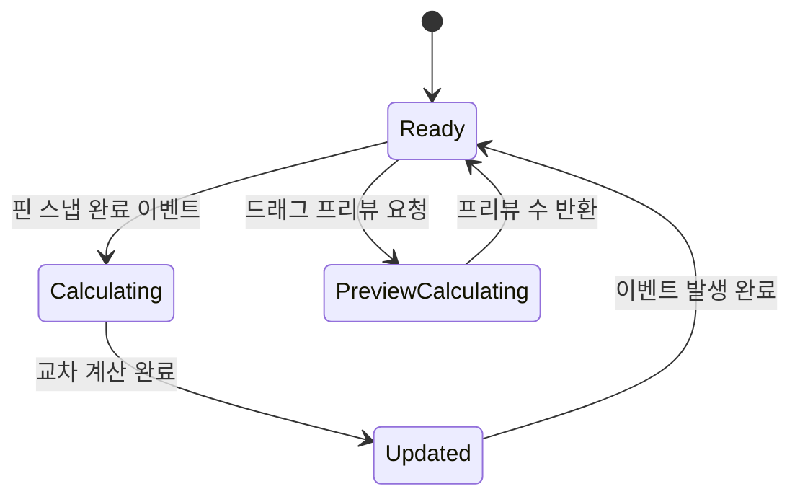

# GDD - SYS_025: IntersectionSystem (교차 판정 시스템)

## 시스템 콘텍스트 요약

| 항목 | 내용 |
|------|------|
| **시스템명** | IntersectionSystem |
| **System ID** | SYS_025 |
| **게임 내 위치** | 핵심 게임 로직 |
| **소속 씬** | Game Scene |
| **입력 유형** | SnapSystem 이벤트, 드래그 프리뷰 요청 |
| **반복 여부** | 이벤트 기반 (핀 이동 시) |
| **연동 시스템** | SnapSystem, WinConditionSystem, HUDSystem, HelixRenderSystem |

---

## 책임 범위

1. 모든 로프 쌍의 교차 여부 판정 (2D 기하학)
2. 교차점 좌표 및 상하 관계 계산
3. 교차 데이터 목록 관리 및 갱신
4. 교차 수 변경 이벤트 전파

---

## 입력-처리-출력 구조

### CalculateAllIntersections (전체 교차 계산)

```
[입력] 핀 스냅 완료 이벤트
[처리]
1. 기존 교차 데이터 클리어
2. 모든 로프 쌍에 대해 선분-선분 교차 검사
   - 로프 A의 각 세그먼트 vs 로프 B의 각 세그먼트
3. 교차 발견 시 IntersectionData 생성
   - 교차점 좌표 계산
   - RenderPriority 비교로 TopRope 결정
4. 교차 목록 업데이트
5. 교차 수 변경 이벤트 발생
[출력]
- IntersectionList 갱신
- OnIntersectionCountChanged(int count) 이벤트 발생
```

### CalculateForDragPreview (드래그 프리뷰용 계산)

```
[입력] 드래그 중 핀의 임시 위치
[처리]
1. 드래그 중인 핀에 연결된 로프만 대상
2. 해당 로프 vs 다른 모든 로프 교차 검사
3. 임시 교차 목록 반환 (실제 데이터 미갱신)
[출력]
- 임시 교차 수 반환 (프리뷰용)
```

---

## 핵심 알고리즘: 선분-선분 교차 판정

```csharp
/// <summary>
/// 선분 AB와 선분 CD의 교차 여부 판정
/// 결정론적 2D 기하학 사용 (물리 엔진 미사용)
/// </summary>
public static bool SegmentIntersect(
    Vector2 A, Vector2 B, Vector2 C, Vector2 D,
    out Vector2 intersection, float eps = 1e-6f)
{
    intersection = Vector2.zero;
    Vector2 r = B - A;
    Vector2 s = D - C;
    float rxs = Cross(r, s);

    // 평행하거나 길이 0인 경우
    if (Mathf.Abs(rxs) < eps) return false;

    float t = Cross(C - A, s) / rxs;
    float u = Cross(C - A, r) / rxs;

    // t와 u가 [0,1] 범위면 교차
    if (t >= -eps && t <= 1 + eps && u >= -eps && u <= 1 + eps)
    {
        intersection = A + t * r;
        return true;
    }
    return false;
}

private static float Cross(Vector2 a, Vector2 b)
{
    return a.x * b.y - a.y * b.x;
}
```

---

## 클래스 명세

```csharp
// 클래스명: IntersectionCalculator
// 유형: 일반 클래스 (MonoBehaviour 아님)
// 책임 범위: 순수 교차 판정 로직 (상태 없음)

public static class IntersectionCalculator
{
    // 선분-선분 교차 판정
    public static bool SegmentIntersect(
        Vector2 A, Vector2 B, Vector2 C, Vector2 D,
        out Vector2 intersection, float eps = 1e-6f);

    // 두 로프의 교차점 목록 반환
    public static List<IntersectionData> FindRopeIntersections(
        RopeData ropeA, RopeData ropeB,
        List<PinData> pins);

    // 전체 로프 교차 계산
    public static List<IntersectionData> CalculateAllIntersections(
        List<RopeData> ropes, List<PinData> pins);
}

// 클래스명: IntersectionManager
// 유형: MonoBehaviour (Singleton)
// 책임 범위: 교차 데이터 관리, 이벤트 발생

public class IntersectionManager : MonoBehaviour
{
    // === 필드 ===
    private List<IntersectionData> _intersections = new List<IntersectionData>();

    // === 프로퍼티 ===
    public int IntersectionCount => _intersections.Count;
    public IReadOnlyList<IntersectionData> Intersections => _intersections;

    // === 이벤트 ===
    public event Action<int> OnIntersectionCountChanged;
    public event Action<List<IntersectionData>> OnIntersectionsUpdated;

    // === 주요 메서드 ===
    public void RecalculateAll();
    public int GetPreviewCount(PinData pin, Vector2 previewPos);
}
```

---

## 함수 단위 명세

### RecalculateAll()

```
함수명: RecalculateAll()
입력: 없음 (GameManager에서 로프/핀 데이터 참조)
반환값: void
처리:
    List<RopeData> ropes = GameManager.Instance.Ropes
    List<PinData> pins = GameManager.Instance.Pins

    _intersections = IntersectionCalculator.CalculateAllIntersections(ropes, pins)

    OnIntersectionCountChanged?.Invoke(_intersections.Count)
    OnIntersectionsUpdated?.Invoke(_intersections)
```

### CalculateAllIntersections() (Static)

```
함수명: CalculateAllIntersections(List<RopeData> ropes, List<PinData> pins)
입력:
  - ropes: 모든 로프 데이터
  - pins: 모든 핀 데이터
반환값: List<IntersectionData>
처리:
    var result = new List<IntersectionData>()

    // 모든 로프 쌍 검사 (O(N²))
    for (int i = 0; i < ropes.Count; i++)
        for (int j = i + 1; j < ropes.Count; j++)
            var crossings = FindRopeIntersections(ropes[i], ropes[j], pins)
            result.AddRange(crossings)

    return result
```

### FindRopeIntersections()

```
함수명: FindRopeIntersections(RopeData ropeA, RopeData ropeB, List<PinData> pins)
입력:
  - ropeA, ropeB: 검사할 두 로프
  - pins: 핀 데이터 (좌표 참조용)
반환값: List<IntersectionData>
처리:
    var result = new List<IntersectionData>()

    // 로프 A의 핀들 좌표 획득
    Vector2 pinA0 = GetPinPosition(ropeA.PinIds[0], pins)
    Vector2 pinA1 = GetPinPosition(ropeA.PinIds[1], pins)

    // 로프 B의 핀들 좌표 획득
    Vector2 pinB0 = GetPinPosition(ropeB.PinIds[0], pins)
    Vector2 pinB1 = GetPinPosition(ropeB.PinIds[1], pins)

    // 선분 교차 검사
    if (SegmentIntersect(pinA0, pinA1, pinB0, pinB1, out Vector2 point))
        var intersection = new IntersectionData
        {
            RopeAId = ropeA.Id,
            RopeBId = ropeB.Id,
            SegmentAIndex = 0,
            SegmentBIndex = 0,
            Point = point,
            TopRopeId = ropeA.RenderPriority > ropeB.RenderPriority ? ropeA.Id : ropeB.Id
        }
        result.Add(intersection)

    return result
```

### GetPreviewCount()

```
함수명: GetPreviewCount(PinData pin, Vector2 previewPos)
입력:
  - pin: 드래그 중인 핀
  - previewPos: 핀의 임시 위치
반환값: int (프리뷰 교차 수)
처리:
    // 임시로 핀 위치 변경
    Vector2 originalPos = pin.LogicPos
    pin.LogicPos = previewPos

    // 교차 계산
    var ropes = GameManager.Instance.Ropes
    var pins = GameManager.Instance.Pins
    var previewIntersections = IntersectionCalculator.CalculateAllIntersections(ropes, pins)

    // 원래 위치 복원
    pin.LogicPos = originalPos

    return previewIntersections.Count
```

---

## 성능 최적화

### 드래그 중 최적화 (O(N) 목표)

```
[최적화 전략]
- 드래그 중: 현재 드래그 핀에 연결된 로프 vs 나머지 로프만 검사
- 드롭 후: 전체 로프 간 교차 재계산 (O(N²), N < 50 이므로 모바일 OK)

[구현]
public int GetPreviewCountOptimized(PinData pin, Vector2 previewPos)
{
    RopeData draggedRope = GetRope(pin.RopeId);
    int count = 0;

    foreach (var otherRope in ropes)
    {
        if (otherRope.Id == draggedRope.Id) continue;
        // 드래그 로프 vs 다른 로프만 검사
        var crossings = FindRopeIntersections(draggedRope, otherRope, pins);
        count += crossings.Count;
    }

    return count;
}
```

---

## 상태 흐름



---

## 시스템 연동 지점

```csharp
// SnapSystem 연동
SnapSystem.OnPinSnapped += IntersectionManager.RecalculateAll;

// WinConditionSystem 연동
IntersectionManager.OnIntersectionCountChanged += (count) => {
    if (count == 0)
        WinConditionSystem.OnLevelCleared();
};

// HUDSystem 연동
IntersectionManager.OnIntersectionCountChanged += HUDSystem.UpdateIntersectionCount;

// HelixRenderSystem 연동
IntersectionManager.OnIntersectionsUpdated += HelixRenderSystem.UpdateHelixPoints;
```

---

## LLM 최적화 주석

```
// LLM 설명용: 이 시스템은 물리 엔진을 사용하지 않고 순수 수학으로 교차를 판정합니다.
// LLM 설명용: 결정론적 판정으로 프레임마다 결과가 달라지는 문제를 방지합니다.
// LLM 설명용: eps(epsilon)는 부동소수점 오차를 허용하기 위한 값입니다.
// LLM 설명용: TopRopeId는 교차점에서 위에 있는 로프를 결정하여 나선형 렌더링에 사용됩니다.
// LLM 설명용: 로프 수가 50개 미만이면 O(N²) 알고리즘도 모바일에서 문제없습니다.
```
