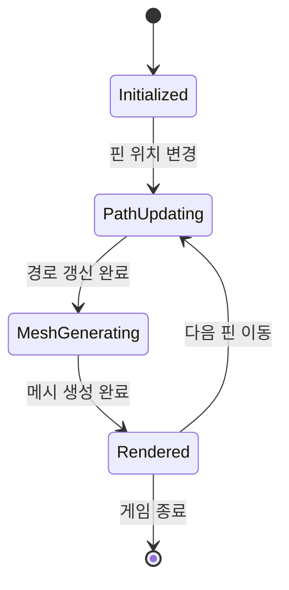

# GDD - SYS_027: RopeRenderSystem (로프 렌더링 시스템)

## 시스템 콘텍스트 요약

| 항목 | 내용 |
|------|------|
| **시스템명** | RopeRenderSystem |
| **System ID** | SYS_027 |
| **게임 내 위치** | 렌더링 레이어 |
| **소속 씬** | Game Scene |
| **입력 유형** | SnapSystem 이벤트, 드래그 프리뷰 |
| **반복 여부** | 이벤트 기반 + 애니메이션 업데이트 |
| **연동 시스템** | SnapSystem, HelixRenderSystem, RopeAnimationSystem |

---

## 책임 범위

1. 로프 경로(RenderPath) 계산 및 관리
2. 3D 튜브 메시(Procedural Mesh) 생성
3. Catmull-Rom Spline 보간으로 부드러운 곡선 생성
4. UV 매핑 (꼬임 텍스처 타일링)

---

## 입력-처리-출력 구조

### UpdateRopePath (로프 경로 갱신)

```
[입력] 핀 위치 변경 (스냅 또는 드래그)
[처리]
1. 로프에 연결된 핀들의 3D 좌표 획득
2. 핀 좌표로 기본 경로 생성
3. 교차점 데이터 참조하여 Helix 포인트 삽입 위치 결정
4. Catmull-Rom Spline으로 경로 보간
5. RenderPath 업데이트
[출력]
- RopeData.RenderPath 갱신
- 메시 재생성 트리거
```

### GenerateTubeMesh (튜브 메시 생성)

```
[입력] RenderPath (Vector3 리스트)
[처리]
1. 경로를 따라 원형 단면(Cross Section) 배치
2. 각 단면의 Vertices 생성
3. 인접 단면 간 Triangles 연결
4. UV 좌표 계산 (U: 둘레, V: 경로 길이 기반)
5. Normals 계산
6. Mesh 업데이트
[출력]
- 3D 튜브 형태의 Mesh 생성
- MeshFilter에 할당
```

---

## 클래스 명세

### TubeMeshGenerator (튜브 메시 생성기)

```csharp
// 클래스명: TubeMeshGenerator
// 유형: 일반 클래스 (MonoBehaviour 아님)
// 책임 범위: 순수 메시 생성 로직

public class TubeMeshGenerator
{
    // === 설정 ===
    public float TubeRadius = 0.1f;       // 튜브 반지름
    public int RadialSegments = 8;        // 단면의 세그먼트 수
    public float UVTileScale = 1f;        // UV 타일링 스케일

    // === 주요 메서드 ===

    // 경로로부터 튜브 메시 생성
    public Mesh GenerateMesh(List<Vector3> path);

    // 단면 Vertices 생성
    private List<Vector3> GenerateCrossSection(Vector3 center, Vector3 forward, Vector3 up);

    // UV 좌표 계산
    private Vector2 CalculateUV(int radialIndex, float pathDistance);
}
```

### SplineInterpolator (스플라인 보간기)

```csharp
// 클래스명: SplineInterpolator
// 유형: Static 클래스
// 책임 범위: Catmull-Rom Spline 보간

public static class SplineInterpolator
{
    // Catmull-Rom Spline 보간
    public static List<Vector3> InterpolateCatmullRom(
        List<Vector3> controlPoints,
        int samplesPerSegment = 10);

    // 단일 세그먼트 보간
    private static Vector3 CatmullRomPoint(
        Vector3 p0, Vector3 p1, Vector3 p2, Vector3 p3,
        float t);
}
```

### RopeRenderer (로프 렌더러 컴포넌트)

```csharp
// 클래스명: RopeRenderer
// 유형: MonoBehaviour
// 책임 범위: 개별 로프의 렌더링 관리

public class RopeRenderer : MonoBehaviour
{
    // === 필드 ===
    [SerializeField] private MeshFilter _meshFilter;
    [SerializeField] private MeshRenderer _meshRenderer;
    [SerializeField] private Material _ropeMaterial;

    private RopeData _ropeData;
    private TubeMeshGenerator _meshGenerator;
    private Mesh _mesh;

    // === 주요 메서드 ===

    // 초기화
    public void Initialize(RopeData ropeData);

    // 경로 업데이트 시 메시 재생성
    public void UpdateMesh();

    // 색상 설정
    public void SetColor(Color color);
}
```

---

## 함수 단위 명세

### GenerateMesh()

```
함수명: GenerateMesh(List<Vector3> path)
입력: path - 로프 중심선 경로 (보간된 포인트들)
반환값: Mesh
처리:
    if (path.Count < 2) return null

    var vertices = new List<Vector3>()
    var triangles = new List<int>()
    var uvs = new List<Vector2>()
    var normals = new List<Vector3>()

    float totalLength = CalculateTotalLength(path)
    float currentLength = 0

    for (int i = 0; i < path.Count; i++)
        // 방향 벡터 계산
        Vector3 forward = GetForwardVector(path, i)
        Vector3 up = CalculateUp(forward)

        // 원형 단면 생성
        for (int j = 0; j < RadialSegments; j++)
            float angle = (j / (float)RadialSegments) * Mathf.PI * 2
            Vector3 offset = CalculateRadialOffset(forward, up, angle, TubeRadius)
            vertices.Add(path[i] + offset)

            // UV 계산
            float u = j / (float)RadialSegments
            float v = (currentLength / totalLength) * UVTileScale
            uvs.Add(new Vector2(u, v))

            // Normal 계산
            normals.Add(offset.normalized)

        // 다음 포인트까지 거리 누적
        if (i < path.Count - 1)
            currentLength += Vector3.Distance(path[i], path[i + 1])

    // Triangle 연결
    for (int i = 0; i < path.Count - 1; i++)
        for (int j = 0; j < RadialSegments; j++)
            int current = i * RadialSegments + j
            int next = current + RadialSegments
            int nextJ = (j + 1) % RadialSegments

            triangles.Add(current)
            triangles.Add(next)
            triangles.Add(i * RadialSegments + nextJ)

            triangles.Add(i * RadialSegments + nextJ)
            triangles.Add(next)
            triangles.Add(next + nextJ - j)

    Mesh mesh = new Mesh()
    mesh.vertices = vertices.ToArray()
    mesh.triangles = triangles.ToArray()
    mesh.uv = uvs.ToArray()
    mesh.normals = normals.ToArray()

    return mesh
```

### InterpolateCatmullRom()

```
함수명: InterpolateCatmullRom(List<Vector3> controlPoints, int samplesPerSegment)
입력:
  - controlPoints: 제어점 목록
  - samplesPerSegment: 세그먼트당 샘플 수
반환값: List<Vector3> (보간된 경로)
처리:
    var result = new List<Vector3>()

    for (int i = 0; i < controlPoints.Count - 1; i++)
        // Catmull-Rom은 4개 점 필요 (앞뒤로 확장)
        Vector3 p0 = controlPoints[Mathf.Max(0, i - 1)]
        Vector3 p1 = controlPoints[i]
        Vector3 p2 = controlPoints[i + 1]
        Vector3 p3 = controlPoints[Mathf.Min(controlPoints.Count - 1, i + 2)]

        for (int j = 0; j < samplesPerSegment; j++)
            float t = j / (float)samplesPerSegment
            result.Add(CatmullRomPoint(p0, p1, p2, p3, t))

    // 마지막 점 추가
    result.Add(controlPoints[controlPoints.Count - 1])

    return result
```

### CatmullRomPoint()

```
함수명: CatmullRomPoint(Vector3 p0, Vector3 p1, Vector3 p2, Vector3 p3, float t)
입력: p0~p3 - 4개의 제어점, t - 보간 파라미터 [0,1]
반환값: Vector3 (보간된 점)
처리:
    float t2 = t * t
    float t3 = t2 * t

    return 0.5f * (
        (2f * p1) +
        (-p0 + p2) * t +
        (2f * p0 - 5f * p1 + 4f * p2 - p3) * t2 +
        (-p0 + 3f * p1 - 3f * p2 + p3) * t3
    )
```

---

## 상태 흐름



---

## 시스템 연동 지점

```csharp
// SnapSystem 연동
SnapSystem.OnPinSnapped += (pin, slot) => {
    RopeRenderer rope = GetRopeRenderer(pin.RopeId);
    rope.UpdateMesh();
};

// DragController 연동 (드래그 프리뷰)
DragController.OnDragUpdate += (worldPos) => {
    RopeRenderer rope = GetRopeRenderer(_selectedPin.RopeId);
    rope.UpdateMeshPreview(worldPos);
};

// HelixRenderSystem 연동
// Helix 포인트는 RenderPath에 삽입된 후 메시 생성됨
IntersectionManager.OnIntersectionsUpdated += (intersections) => {
    foreach (var rope in ropes)
        InsertHelixPointsToPath(rope, intersections);
        rope.UpdateMesh();
};
```

---

## UV 매핑 상세

```
[UV 매핑 전략]
- U 좌표: 튜브 둘레 (0~1, 원형 단면)
- V 좌표: 경로 길이 기반 타일링

[효과]
- 꼬인 밧줄 텍스처를 V 방향으로 타일링
- 경로가 길어지면 텍스처가 자연스럽게 반복
- 나선형 패턴이 자동으로 표현됨

[텍스처 요구사항]
- 상하 연결 가능한 seamless 텍스처
- 꼬임 패턴이 포함된 로프 텍스처
```

---

## LLM 최적화 주석

```
// LLM 설명용: 이 시스템은 Procedural Mesh로 로프를 3D 튜브 형태로 렌더링합니다.
// LLM 설명용: Catmull-Rom Spline은 제어점을 지나가는 부드러운 곡선을 생성합니다.
// LLM 설명용: UV의 V좌표를 경로 길이 기반으로 하면 텍스처가 균일하게 타일링됩니다.
// LLM 설명용: RadialSegments가 높을수록 원형에 가깝지만 성능이 저하됩니다 (8~12 권장).
// LLM 설명용: 메시 재생성은 비용이 크므로 필요할 때만 호출해야 합니다.
```
