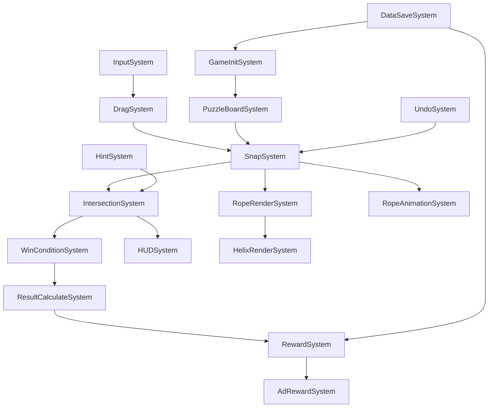
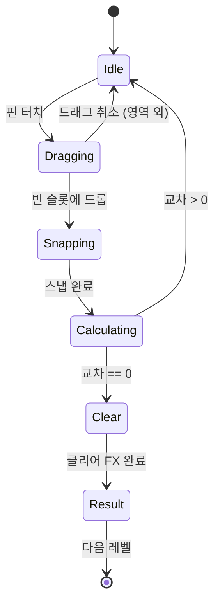

# Rope Untangle Spiral - PRD (Product Requirements Document)

## 1. 프로젝트 개요

| 항목 | 내용 |
|------|------|
| **프로젝트명** | Rope Untangle Spiral |
| **장르** | Untangle 퍼즐 + 하이퍼캐주얼 |
| **플랫폼** | 모바일 (iOS, Android) |
| **엔진** | Unity 2022.3 LTS (3D URP) |
| **게임 시점** | Top-Down (직교 투영) |
| **입력 방식** | 터치 드래그 앤 드롭 |

### 핵심 컨셉
핀을 슬롯에 스냅 이동해 로프 교차를 제거하는 퍼즐 게임. 교차점에서 로프가 "나선형으로 감기는" 3D 연출이 특징.

---

## 2. 씬 구조

```
[게임 씬 구조]
├─ Scene: Splash/Loading (SYS_001~003)
│  ├─ 스플래시 시스템
│  ├─ 버전 체크 시스템
│  └─ 리소스 로딩 시스템
│
├─ Scene: Lobby (SYS_010~019)
│  ├─ 로비 UI 시스템
│  ├─ 레벨 선택 시스템
│  └─ 설정 시스템
│
├─ Scene: Game (SYS_020~039)
│  ├─ 게임 초기화 시스템
│  ├─ 입력 시스템
│  ├─ 퍼즐 보드 시스템
│  ├─ 드래그 시스템
│  ├─ 교차 판정 시스템
│  ├─ 로프 렌더링 시스템
│  ├─ HUD 시스템
│  └─ 힌트/Undo 시스템
│
└─ Scene: Result (SYS_040~049)
   ├─ 결과 계산 시스템
   ├─ 보상 지급 시스템
   └─ 광고 시스템
```

---

## 3. 전체 시스템 리스트

### 3.1 Core Systems (핵심 시스템)

| System ID | 시스템명 | 책임 | 소속 씬 |
|-----------|----------|------|---------|
| SYS_001 | SplashSystem | 스플래시 화면 표시 및 타이머 | Splash |
| SYS_002 | VersionCheckSystem | 앱 버전 확인 및 강제 업데이트 | Splash |
| SYS_003 | ResourceLoadSystem | 필수 리소스 사전 로딩 | Splash |
| SYS_010 | LobbyUISystem | 로비 화면 UI 관리 | Lobby |
| SYS_011 | LevelSelectSystem | 레벨 선택 및 잠금 상태 관리 | Lobby |
| SYS_012 | SettingsSystem | 사운드, 진동 등 설정 관리 | Lobby |

### 3.2 Game Systems (게임 플레이 시스템)

| System ID | 시스템명 | 책임 | 소속 씬 |
|-----------|----------|------|---------|
| SYS_020 | GameInitSystem | 레벨 데이터 로드 및 게임 초기화 | Game |
| SYS_021 | InputSystem | 터치 입력 감지 및 이벤트 전파 | Game |
| SYS_022 | PuzzleBoardSystem | 슬롯/핀/로프 생성 및 배치 | Game |
| SYS_023 | DragSystem | 핀 드래그 앤 드롭 처리 | Game |
| SYS_024 | SnapSystem | 핀-슬롯 스냅 및 점유 관리 | Game |
| SYS_025 | IntersectionSystem | 로프 교차 판정 (2D 기하학) | Game |
| SYS_026 | WinConditionSystem | 승리 조건 체크 (교차 수 0) | Game |
| SYS_027 | RopeRenderSystem | 3D 튜브 메시 생성 및 갱신 | Game |
| SYS_028 | HelixRenderSystem | 교차점 나선형 감김 렌더링 | Game |
| SYS_029 | RopeAnimationSystem | 로프 흔들림/스프링 애니메이션 | Game |
| SYS_030 | HUDSystem | 레벨 표시, 교차 수, 버튼 등 HUD | Game |
| SYS_031 | HintSystem | 힌트 제공 (최적 이동 표시) | Game |
| SYS_032 | UndoSystem | 이전 상태로 되돌리기 | Game |

### 3.3 Result Systems (결과 시스템)

| System ID | 시스템명 | 책임 | 소속 씬 |
|-----------|----------|------|---------|
| SYS_040 | ResultCalculateSystem | 클리어 시간, 이동 횟수 등 계산 | Result |
| SYS_041 | RewardSystem | 보상 지급 (코인 등) | Result |
| SYS_042 | AdRewardSystem | 광고 시청 후 2배 보상 | Result |

### 3.4 Support Systems (지원 시스템)

| System ID | 시스템명 | 책임 | 소속 씬 |
|-----------|----------|------|---------|
| SYS_050 | DataSaveSystem | 진행 상황 저장/로드 | Global |
| SYS_051 | SoundSystem | 효과음, 배경음 관리 | Global |
| SYS_052 | HapticSystem | 진동 피드백 | Global |
| SYS_053 | AnalyticsSystem | 이벤트 로깅 | Global |

---

## 4. 시스템 간 의존성 매핑

```
[의존성 맵]

입력 흐름:
InputSystem → DragSystem → SnapSystem → IntersectionSystem → WinConditionSystem

렌더링 흐름:
SnapSystem → RopeRenderSystem → HelixRenderSystem
           → RopeAnimationSystem

데이터 흐름:
GameInitSystem → PuzzleBoardSystem
              → DataSaveSystem

UI 흐름:
IntersectionSystem → HUDSystem (교차 수 업데이트)
WinConditionSystem → ResultCalculateSystem → RewardSystem

보조 흐름:
HintSystem → IntersectionSystem (최적 이동 계산)
UndoSystem → SnapSystem (상태 복원)
```

### 상세 의존성 다이어그램



---

## 5. 데이터 모델

### 5.1 Core Data Models

```csharp
// 슬롯 데이터
public class SlotData
{
    public int Id;
    public Vector2 Position;          // 판정용 2D 좌표
    public int OccupiedByPinId = -1;  // 점유한 핀 ID (-1: 비어있음)
}

// 핀 데이터
public class PinData
{
    public int Id;
    public int SlotIndex;             // 현재 위치한 슬롯 인덱스
    public int RopeId;                // 연결된 로프 ID
    public Vector2 LogicPos;          // 판정용 2D 좌표 (Slot.Position 캐시)
    public Vector3 WorldPos;          // 렌더링용 3D 좌표
}

// 로프 데이터
public class RopeData
{
    public int Id;
    public Color RopeColor;           // 로프 색상
    public List<int> PinIds;          // 연결된 핀 ID 목록 (MVP: 2개)
    public int RenderPriority;        // 렌더링 우선순위 (Z 정렬)
    public List<Vector3> RenderPath;  // 튜브 메시 생성용 경로
}

// 교차 데이터
public class IntersectionData
{
    public int RopeAId, RopeBId;      // 교차하는 두 로프 ID
    public int SegmentAIndex;         // 로프A의 세그먼트 인덱스
    public int SegmentBIndex;         // 로프B의 세그먼트 인덱스
    public Vector2 Point;             // 교차점 좌표
    public int TopRopeId;             // 위에 있는 로프 ID
}
```

### 5.2 Level Data

```csharp
// 레벨 데이터
public class LevelData
{
    public int LevelId;
    public int GridRows;              // 그리드 행 수
    public int GridCols;              // 그리드 열 수
    public List<SlotData> Slots;      // 슬롯 목록
    public List<PinData> Pins;        // 핀 목록
    public List<RopeData> Ropes;      // 로프 목록
    public int TargetMoves;           // 목표 이동 횟수 (별점 계산용)
}
```

---

## 6. 핵심 게임 루프

### 6.1 유저 플로우

```
1. 레벨 시작
   └─ GameInitSystem: 레벨 데이터 로드
   └─ PuzzleBoardSystem: 슬롯/핀/로프 생성

2. 핀 드래그
   └─ InputSystem: 터치 감지
   └─ DragSystem: 핀 선택 및 드래그 처리
   └─ HUDSystem: 가장 가까운 빈 슬롯 하이라이트

3. 빈 슬롯 스냅
   └─ SnapSystem: 핀 위치 업데이트, 점유 상태 변경
   └─ RopeRenderSystem: 로프 경로 갱신
   └─ RopeAnimationSystem: 드롭 애니메이션 재생

4. 교차 수 갱신 (실시간)
   └─ IntersectionSystem: 전체 교차 재계산
   └─ HelixRenderSystem: 교차점 나선형 렌더링
   └─ HUDSystem: 교차 수 표시 업데이트

5. 교차 0 달성
   └─ WinConditionSystem: 승리 조건 충족 감지
   └─ 클리어 FX 재생

6. 결과/보상
   └─ ResultCalculateSystem: 점수 계산
   └─ RewardSystem: 보상 지급
   └─ AdRewardSystem: 광고 시청 옵션

7. 다음 레벨
   └─ LevelSelectSystem: 다음 레벨 잠금 해제
   └─ GameInitSystem: 다음 레벨 로드
```

### 6.2 상태 다이어그램



---

## 7. 입력/출력 명세

### 7.1 입력 이벤트

| 이벤트 | 트리거 | 처리 시스템 | 결과 |
|--------|--------|-------------|------|
| TouchDown | 핀 터치 | InputSystem → DragSystem | 핀 선택, 드래그 시작 |
| TouchMove | 드래그 중 | DragSystem | 핀 위치 업데이트, 스냅 프리뷰 |
| TouchUp | 터치 해제 | DragSystem → SnapSystem | 스냅 또는 롤백 |
| ButtonClick_Hint | 힌트 버튼 | HintSystem | 최적 이동 표시 |
| ButtonClick_Undo | Undo 버튼 | UndoSystem | 이전 상태 복원 |
| ButtonClick_Pause | 일시정지 버튼 | HUDSystem | 일시정지 팝업 |

### 7.2 출력 피드백

| 이벤트 | 시각 피드백 | 청각 피드백 | 햅틱 피드백 |
|--------|-------------|-------------|-------------|
| 핀 선택 | 핀 확대 (1.2x) | 클릭음 | 약한 진동 |
| 스냅 성공 | 스냅 이펙트 | 스냅음 | 중간 진동 |
| 교차 발생 | 교차점 글로우 | 경고음 | - |
| 교차 해소 | 교차점 페이드아웃 | 해소음 | - |
| 레벨 클리어 | 파티클 FX | 클리어 BGM | 강한 진동 |

---

## 8. UI 화면 구성

### 8.1 Game Scene HUD

```
┌─────────────────────────────────────┐
│  [Pause]     Level 15     [0/3]     │  ← 상단 바
│                                      │
│                                      │
│                                      │
│           ┌───────────┐              │
│           │  퍼즐     │              │  ← 중앙 게임 보드
│           │  보드     │              │
│           └───────────┘              │
│                                      │
│                                      │
│                                      │
│  [Undo]              [Hint]          │  ← 하단 버튼
└─────────────────────────────────────┘
```

### 8.2 주요 팝업

| 팝업 | 트리거 | 내용 |
|------|--------|------|
| Popup_Pause | 일시정지 버튼 | 계속, 재시작, 홈 버튼 |
| Popup_Clear | 레벨 클리어 | 별점, 보상, 다음 레벨 버튼 |
| Popup_Settings | 설정 버튼 | 사운드, 진동, 언어 설정 |

---

## 9. 난이도 파라미터

| 레벨 범위 | 로프 수 | 슬롯 여유 | 초기 교차 수 | 비고 |
|-----------|---------|-----------|--------------|------|
| 1~5 | 2~3 | 많음 (+3) | 1~2 | 튜토리얼 |
| 6~20 | 3~4 | 보통 (+2) | 2~4 | 초급 |
| 21~50 | 4~5 | 적음 (+1) | 4~6 | 중급 |
| 51+ | 5+ | 최소 (+0) | 6+ | 고급 |

---

## 10. 수익화 트리거

### 10.1 Rewarded Video

| 위치 | 트리거 | 보상 |
|------|--------|------|
| 힌트 사용 | 힌트 버튼 (무료 소진 후) | 힌트 1회 |
| Undo 사용 | Undo 버튼 (무료 소진 후) | Undo 1회 |
| 클리어 2배 보상 | 결과 화면 버튼 | 코인 2배 |

### 10.2 Interstitial

| 위치 | 빈도 | 조건 |
|------|------|------|
| 레벨 클리어 후 | 2~3레벨당 1회 | 리모트 설정 |

### 10.3 IAP

| 상품 | 가격대 | 내용 |
|------|--------|------|
| Remove Ads | $2.99 | 배너/전면 광고 제거 |
